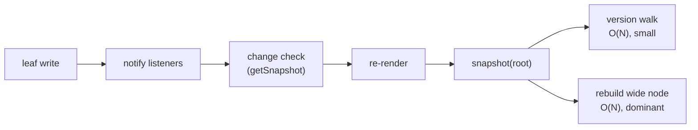

# Valtio v3 O(1) Subscription — Design

Draft · 2026-09-23

## Summary

A leaf write should cost O(readers of that key + ancestors), independent of how many siblings or unrelated subscribers exist. This draft proposes three changes to get there, and nothing is implemented until we agree on it.

1. **Vanilla:** per-key versions and key subscriptions, plus on-demand upward version propagation, so no snapshot has to walk the whole tree.
2. **React:** re-render when a read key's version has moved past the version the render saw. No leaf comparison, no proxy-compare.
3. **Boundary:** `valtio/react` uses only public `valtio/vanilla` APIs, and vanilla never refers to React. Vanilla adds three exports and extends two existing ones.

Sync-only notifications and `batch()` land first, as a separate PR into `v3`. The existing `v3-o1-subscription-*` branches are treated as hints, not a base.

## Goals and requirements

The goal is fast atomic mutation: `state.nested.count = 1` must not cost work proportional to unrelated state or subscribers. Replacing a whole object (`state.nested = { count: 1 }`) may cost more; `applyChanges` is its fast path.

| #   | Requirement                                                                                            | Consequence for this design                                                                                     |
| --- | ------------------------------------------------------------------------------------------------------ | --------------------------------------------------------------------------------------------------------------- |
| R1  | A leaf write costs O(1) in the #1160 scenario: N item components, one item changes                     | Fan-out, change detection and version bookkeeping must all avoid O(N)                                           |
| R2  | A migrating v2 user notices breaking changes through a TypeScript or runtime error, for most use cases | Silent breaks are allowed only when harmless (extra renders) or rare (docs only)                                |
| R3  | `valtio/react` is built on `valtio/vanilla`; vanilla knows nothing about React                         | React uses public vanilla exports only, no `unstable_*` internals; vanilla never unwraps or marks React objects |

R3 fixes a v2 violation: `src/vanilla.ts` imports `markToTrack` and `getUntracked` from proxy-compare, marking snapshots for React's tracking and unwrapping React's proxies on assignment.

**Non-goals for this branch:** getter result caching (`valtio-reactive` covers computed values), valtio-reactive compatibility, scoped `ref`, and a replacement for `unstable_replaceInternalFunction`.

## Problem analysis: where #1160's O(N) lives

Key subscriptions remove the N-way fan-out, but a leaf write still costs O(N). Over 90% of what remains is rebuilding the snapshot of the wide node that holds the N items; the version walk is under 10%.

The #1160 shape: `state.items` holds N objects, and N components each render `useSnapshot(state).items[id].count`. One write changes one item.

v2 pays O(N) at the notify step, one callback per component. The WIP candidate pays it only in the last step, once per write.

| Per leaf write                                 | v3 today (v2 design) | WIP candidate |
| ---------------------------------------------- | -------------------- | ------------- |
| Components woken                               | N                    | 1             |
| Write to commit, N = 1,000                     | 5.1 ms               | 3.6 ms        |
| Write to commit, N = 5,000                     | 25.4 ms              | 9.5 ms        |
| `snapshot(root)`, N = 5,000: version walk only | 0.30 ms              | 0.35 ms       |
| `snapshot(root)`, N = 5,000: walk + rebuild    | 4.1 ms               | 4.3 ms        |
| `snapshot(root)`, N = 50,000: walk + rebuild   | 82 ms                | 89 ms         |

Medians of 15 writes, vitest + jsdom, React 19 dev build. The walk-only row writes to an unrelated proxy, so only the global clock moves.

**Conclusion.** "O(1) subscription alone doesn't solve #1160" holds at two layers:

1. **Version walk.** `snapshot()` re-validates every descendant after any write. Upward propagation fixes this (Vanilla section).
2. **Wide-node rebuild.** An immutable snapshot of an N-key object costs O(N) to rebuild whenever one child changes. Only on-demand materialization, or a cheaper snapshot representation, removes it (React section, option B).

The second is the larger cost, so it decides whether #1160 is truly fixed.

## Delivery plan

Two PRs, in order: a precursor that makes notifications sync-only, then the `v3-o1-subscription` branch. The precursor goes first because the new key-subscription API reuses the third `subscribe` parameter that `notifyInSync` occupies today.

**PR 1 — precursor into `v3`: sync-only notifications and `batch()`**

- Remove `notifyInSync` from `subscribe` and `subscribeKey`, and `sync` from `useSnapshot`. Each is a TypeScript error for existing callers.
- Add `batch(fn)` to vanilla. Listeners are deferred until the outermost `batch` returns, then each runs once with the accumulated ops. Versions still move immediately, so `snapshot()` inside a batch sees the writes.
- Open: native array methods (`splice`, `sort`) perform many writes. With sync delivery, listeners see each intermediate state (see Open questions).

**PR 2 — `v3-o1-subscription` into `v3`**, one reviewable commit per layer, each passing tests on its own:

1. Vanilla: `isProxyObject` and `unstable_isRef`; utils stop reading `unstable_getInternalStates` where these suffice.
2. Vanilla: key versions, key subscriptions, upward version propagation, and no notification when deleting an absent key.
3. Vanilla: snapshot semantics — live getters, the snapshot brand, and the assignment error.
4. React: new tracker, `trackKey`, and removal of the proxy-compare dependency.
5. Utils: `applyChanges`.
6. Docs: migration guide and API pages.

Tests from the WIP branches are ported into the commit whose behavior they cover. Both branches are pushed to `daishikato/valtio`.

## Vanilla: version model and on-demand propagation

Every write takes one number from a global clock, and vanilla records it at two granularities: per key and per proxy subtree. Versions are pushed up to parents when a write happens, so no snapshot re-validates the tree.

| Version                 | Meaning                                                                                           | Read by                               |
| ----------------------- | ------------------------------------------------------------------------------------------------- | ------------------------------------- |
| Key version of `(P, k)` | Clock value of the last direct write or delete of `k` on `P`. Descendant writes do not change it. | React change detection                |
| Proxy version of `P`    | Latest write anywhere in `P`'s subtree. Changes exactly when `snapshot(P)` would.                 | Snapshot cache, React container reads |

- **Key versions** are stored only for keys that were written. An unwritten key reports `P`'s creation version, so memory is O(keys written).
- **Implicit writes count.** `push` moves the new index and `length`; shrinking `length` moves every removed index.

**Propagation — my reading of "on-demand subscription":**

- A parent links to its children the first time something needs its subtree version: `snapshot(P)`, `getVersion(P)` or a subtree `subscribe(P)`. That first pass is O(subtree), which the first snapshot pays anyway.
- After that, a write bumps the proxy version of every linked ancestor: O(depth × parents). A later `snapshot` of an unchanged subtree is a cache hit.
- A child attached to a linked parent is linked with it. Replacing or deleting a child unlinks it.
- Cycles and shared children need only a visited set per write. Versions are pushed, not recomputed, so the Tarjan-style pass in the WIP branches is unnecessary.

The alternative is linking every child at creation. It is simpler and differs only for state that is never snapshotted or subscribed, which then pays O(depth) per write for nothing. A React app snapshots its roots on first render, so there both behave the same.

This removes the version walk from #1160, not the wide-node rebuild.

## Vanilla: notifications and public API

Vanilla gains a per-key listener, an own-keys signal, three new exports and two extended ones. React needs all of them except `unstable_isRef`, which is for utils, and nothing else from vanilla.

**Listener kinds**

- **Key listener:** fires on a direct write or delete of one key on one proxy, including implicit writes such as `length`. Descendant writes do not fire it. Registration is O(1).
- **Subtree listener:** today's `subscribe(p, cb)`. Fires on any write in `p`'s subtree through the links above, so registering it is O(1) too.
- Both are synchronous after PR 1 and deferred inside `batch()`. Writing the same value, or deleting an absent key, notifies nobody.
- Replacing `state.child` fires `state`'s key listener for `child`. The old child's own listeners stay silent: it was detached, not mutated. The WIP branches notified the whole old subtree instead.

**Proposed exports, for strict review**

| Export               | Status          | Semantics                                                                                                                 | Needed by                                                  |
| -------------------- | --------------- | ------------------------------------------------------------------------------------------------------------------------- | ---------------------------------------------------------- |
| `subscribe(p, cb)`   | Changed in PR 1 | Sync; whole subtree                                                                                                       | React container reads; users                               |
| Key subscription     | New             | Fires on direct writes and deletes of one key                                                                             | React; `subscribeKey`                                      |
| `getVersion(p, key)` | New overload    | Key version, on the same clock as `getVersion(p)`, so the two are comparable                                              | React change detection                                     |
| Own-keys signal      | New             | Key version and listener for additions and deletions of own keys; shape open, for example a vanilla-exported sentinel key | React `Object.keys` reads                                  |
| `isProxyObject(x)`   | New             | Boolean membership; deliberately not a type guard                                                                         | React child lookup; `proxyMap`, `proxySet`, `applyChanges` |
| `unstable_isRef(x)`  | New             | Boolean                                                                                                                   | `deepClone`, `applyChanges`                                |
| Snapshot brand       | New             | Symbol present on every snapshot object                                                                                   | Assignment error; React reads it untracked                 |

**Shape of the key subscription** — three options:

- **(a)** `subscribe(p, cb, { key })`. No new export, and PR 1 frees the third parameter. The cost is a hidden asymmetry: with `key` it is non-recursive, without it the whole subtree.
- **(b)** Move `subscribeKey` into core. Existing users see no change, but its `Object.is` value filter misses `'k' in tracked` flipping when an `undefined` key is added or deleted.
- **(c)** A new raw export, with `subscribeKey` in utils rebuilt on it.

I lean towards (a).

**Not proposed**, compared with the WIP branches: recursive per-key subscriptions (`{ keys, recursive }`), detachment notifications to old subtrees, and new entries in `unstable_getInternalStates`. `unstable_getInternalStates` and `unstable_replaceInternalFunction` stay as they are; React simply stops using them.

## Vanilla: snapshot semantics

Snapshots stay plain objects with read-only data properties and their original prototypes. Two things change: own getters become live accessors, and every snapshot object carries a brand that makes assigning it into state throw.

**Live getters**

- An own getter is copied to the snapshot as an accessor, not evaluated. Each access runs it with the snapshot, or React's tracked snapshot, as `this`.
- Results are not cached, so an object-returning getter gives a new identity per access. Exceptions surface on access, not in `snapshot()`.
- A getter that reads `state.count` through a closure reads live state and is not tracked by React. This is docs-only.
- Own setters are left out of snapshots. Class accessors on the prototype behave as today. `Object.preventExtensions` stays out, for Hermes (#1220).

**Brand and the assignment error**

- Each snapshot object has a non-enumerable own symbol property. Spread, `Object.assign`, JSON and `structuredClone` do not copy it; `Reflect.ownKeys` sees it, so `deepClone` must skip it.
- Vanilla's `set` trap and `proxy()` read that symbol from incoming objects. If it is present, they throw a `TypeError` that suggests `deepClone`, `applyChanges`, or `ref`.
- `proxy()` initializes nested values through the `set` trap, so `state.x = { child: snap.y }` is caught too. `ref(snap)` stays allowed, for storing history.
- React's tracking proxy passes the brand read through without tracking it, so `state.x = tracked.y` throws the same error.

The brand keeps R3: vanilla recognizes only its own objects, and React depends on vanilla's symbol, never the reverse. v2's `getUntracked` and the WIP `INTERNAL_UNWRAP` both had vanilla act on React's proxies.

In v2 these assignments already misbehaved silently: after `state.b = snap.a`, the write `state.b.count = 2` leaves `count` at 1. Read-only uses, such as storing a snapshot for display, did work, so the error message must point to `ref`.

## React: version-based change detection

React records which `(proxy, key)` pairs a render read and the version it rendered at. It re-renders when any of those keys has a newer version. There is no leaf comparison, and no snapshot is taken to decide.

### Option A (proposed): tracking proxies over vanilla snapshots

On render, React takes `S = snapshot(root)` and `G = getVersion(root)`. Both are cache hits unless something under `root` changed. It returns a tracking proxy over `S`, bound to the live `root`.

| Read on a node bound to proxy `P`                                        | Recorded                                            | Subscribed after commit                         |
| ------------------------------------------------------------------------ | --------------------------------------------------- | ----------------------------------------------- |
| `t.k`, `'k' in t`, descriptor of `k`                                     | Key `(P, k)`                                        | Key listener                                    |
| `t.child`, an object                                                     | Key `(P, child)`; the child binds to live `P.child` | Key listener                                    |
| `Object.keys(t)`, `for...in`                                             | Own keys of `P`                                     | Own-keys listener: additions and deletions only |
| A node read without any key, such as an effect dependency, or `trackKey` | Container of that node                              | Subtree listener                                |
| A getter                                                                 | The reads it makes through `this`                   | As above                                        |

**Change rule:** a render is stale if a recorded key has `getVersion(P, k) > G`, or a recorded container has `getVersion(P) > G`. Every check outside render uses only this rule: O(records), no `snapshot()` call.

- **Child lookup.** `P.child` is read live and accepted if `isProxyObject` holds and `getVersion(P, 'child') ≤ G`. Otherwise the render already counts as stale. This replaces the WIP branches' `snapshot(P[k]) === S[k]` probe and their snapshot-to-source registries. A snapshot stored with `ref` is never mistaken for a child, because `P.k` is not a proxy.
- **Gaps.** Writes between render and subscribe, and concurrent tearing, are caught by the same rule when `useSyncExternalStore` re-checks after render.
- **Subscriptions** are diffed against the previous commit: O(records changed) per render, not full re-registration.
- **Late reads**, from event handlers or memoized children rendering later, are recorded and subscribed immediately, which keeps v2's memo pattern working. Reads from an interrupted concurrent render are dropped.
- **`trackKey(tracked, key)`** in `valtio/react` forces a container record. It replaces proxy-compare's `trackMemo`.
- **Removed:** proxy-compare, leaf comparison, the `TRACK_*` flag algebra, and snapshot-to-source registries.

### Option B: on-demand materialization

React stops calling `snapshot(root)`. Tracked objects become views over live proxies, created per node on first read and cached per proxy version. The change rule keeps them consistent: reading a key whose version exceeds `G` invalidates the render.

- **Gain:** a render costs O(keys read). The wide-node rebuild from the Problem analysis (4.3 ms at N = 5,000, 89 ms at N = 50,000) disappears.
- **Cost:** views are not snapshots. Reading a tracked value in an event handler after a later write returns the newer value, where v2 returns the render-time value. That change is silent, so it needs an R2 decision.
- **Why not a cheaper eager copy:** it only changes constants. Even a plain `{ ...prev }` clone of a 50,000-key object takes 27 ms here.

B needs no vanilla API beyond A's, so the vanilla design does not depend on this choice. I propose A for this branch, with B as a follow-up if the wide-node cost matters.

## React: what users see, and which tests change

Dropping leaf comparison costs one tested behavior: replacing a child with equal leaves now re-renders. The other test changes come from decisions already made (live getters, the brand, removing proxy-compare), or disappear once vanilla has an own-keys signal.

**Extra renders.** All are silent and harmless, which R2 allows.

| Case                                                                                   | v2        | Option A                                 |
| -------------------------------------------------------------------------------------- | --------- | ---------------------------------------- |
| Replacing a read child with equal used leaves, e.g. `state.data = await res.json()`    | No render | Render                                   |
| A getter's result is unchanged but its input changed, e.g. `isEven` after `count += 2` | No render | Render                                   |
| A key is written and written back between two checks                                   | No render | Render; rare once notifications are sync |

The first row is the fetch-and-replace pattern v2 was optimized for (#1160). Its v3 remedy is `applyChanges(state.data, await res.json())`, documented in the migration guide.

**`Object.keys` must stay precise.** Tracking it with a subtree listener would re-render a list parent such as `Object.keys(t.items).map(…)` on every item's leaf write. That is exactly the #1160 pattern, hence the own-keys signal in the vanilla API.

**Existing `v3` tests that change.** I found these by reading the suite; running an implementation will confirm the list.

| Test                                                                     | Cause                                                  | Driven by                |
| ------------------------------------------------------------------------ | ------------------------------------------------------ | ------------------------ |
| `optimization`: "should not rerender if the leaf value does not change"  | Equal-leaf replacement re-renders                      | Dropping leaf comparison |
| `optimization`: "should unwrap nested snapshots assigned outside render" | The assignment now throws                              | Snapshot brand           |
| `getter`: "simple object getters", "object getters returning object"     | The getter runs on every access, not once per snapshot | Live getters             |
| `vanilla/snapshot`: proxy-compare interop                                | proxy-compare is removed                               | R3                       |
| `optimization`: "should track property enumeration"                      | Passes only with the own-keys signal                   | Vanilla API              |

My recommendation is to accept the extra renders: they are the price of the simple version rule, and `applyChanges` removes the common one.

## `applyChanges`

Yes, `applyChanges(state.nested, next)` can take a vanilla snapshot or a React tracked snapshot as `next`, with no brand involved. The condition is that it copies the values it assigns instead of adopting `next`'s objects.

**Semantics**, in `valtio/utils`, two arguments:

1. For each own key of `next`: skip if equal by `Object.is`. If both sides are plain objects or arrays with the same prototype, and the state side is a proxy, recurse. Otherwise assign a copy.
2. Delete keys absent from `next`.
3. Run all writes inside `batch()`, so sync listeners see one change (needs PR 1).

**Identity short-circuit.** Before recursing, compare `next[k]` with the same key of `snapshot(proxy)`. Identical subtrees are skipped in O(1). That keeps jotai-valtio's advantage for immutable-update inputs, without its three-argument signature.

**Copy, don't adopt.** Assigned objects are deep-copied with `deepClone` semantics: prototypes kept, `ref` values shared, brand dropped. As a result:

- **Plain objects** are copied. This differs from `state.x = obj`, which adopts `obj` as the proxy target. That is acceptable for input data.
- **Vanilla snapshots** are readable, so copying works, and the brand never reaches the `set` trap.
- **Tracked snapshots** are read through React's proxy, so the reads are recorded as late reads for the rendering component.

The brand is still needed for plain assignment such as `state.x = snap.y`, and its error message points to `applyChanges`. Scope is data properties only: accessors in `next` throw.

## Migration: how users notice each change

Every break that changes correctness surfaces as a TypeScript or runtime error, except two getter changes that stay docs-only. A dev-mode warning can cover the riskier one.

| v2 → v3 change                                                                    | Detection                                                             | Remedy                                |
| --------------------------------------------------------------------------------- | --------------------------------------------------------------------- | ------------------------------------- |
| `notifyInSync` and `sync` removed (PR 1)                                          | TypeScript error                                                      | Remove the argument; use `batch()`    |
| A snapshot or tracked snapshot assigned into state                                | Runtime `TypeError` (brand)                                           | `deepClone`, `applyChanges`, or `ref` |
| An own setter called on a snapshot                                                | Runtime `TypeError` in strict mode                                    | Write to the proxy                    |
| `Object.freeze` on a snapshot, then `useSnapshot`                                 | Runtime error                                                         | Don't freeze snapshots                |
| Getter reads state through a closure (`state.count`)                              | Docs; proposed dev warning when a getter reads nothing through `this` | Read through `this`                   |
| Snapshot getters not cached; object results get a new identity per access         | Docs                                                                  | `proxy-memoize`, or `valtio-reactive` |
| `trackMemo` and `getUntracked` from proxy-compare stop working on tracked objects | Docs                                                                  | `trackKey`                            |
| `useSnapshot` with no reads no longer subscribes                                  | Silent, harmless (accepted)                                           | Read what you render                  |
| Extra renders (see previous section)                                              | Silent, harmless                                                      | `applyChanges`                        |
| Deleting an absent key no longer notifies                                         | Silent, harmless                                                      | —                                     |
| `unstable_getInternalStates` contents change                                      | Unstable API                                                          | —                                     |

The closure-getter row is the riskiest: v2's computed-properties guide itself used `state.count` inside getters. The dev warning is React-only, so it keeps R3; it can false-positive on constant getters.

## Open questions

Questions 1 and 2 decide the architecture; the rest are API and scope details.

1. **"On-demand subscription":** did you mean parent links created on first demand, as in the Vanilla section? Or on-demand materialization in React (Option B), or something else?
2. **Wide-node rebuild:** is Option A acceptable for this branch? It rebuilds an N-key node on each re-render (4.3 ms at N = 5,000), with Option B as a follow-up. Or must #1160's wide node be O(1) now?
3. **Key subscription shape:** (a) `subscribe(p, cb, { key })`, (b) `subscribeKey` in core, or (c) a new raw export?
4. **Own-keys signal shape:** a vanilla-exported sentinel key, accepted by the key subscription and `getVersion(p, key)`, or a separate option?
5. **Brand symbol:** public or `unstable_`, and what name?
6. **PR 1 scope:** should `proxyMap` and `proxySet` methods, whose writes are ours, batch implicitly? Native array methods (`splice`, `sort`) would need a `get` trap to do the same. Does `subscribeInAsync` from #1177 belong in PR 1?
7. **Collections:** besides moving to `isProxyObject`, should this branch fix the existing `proxyMap` bug where a snapshot reached through any wrapper returns wrong results? Today `snap.get('first')` returns `undefined` there.
8. **Late reads from event handlers:** subscribe to them, as v2 effectively does, or limit late reads to renders of memoized children?
9. **Dev warning for closure getters** (Migration section): want it?
10. **React DevTools:** v2 shows the affected paths via `useDebugValue`. Keep an equivalent that lists recorded keys?

## Appendix: evidence and references

All measurements ran in this session's container: Node 22.22.2, vitest 4.1.5 with jsdom, React 19.2.5 dev build. `v3` is `fb594a1`; the WIP candidate is `v3-o1-subscription-versioned-index` at `1fec378`. The benchmark code is not committed.

| Finding                                                                             | Result                                                                                               |
| ----------------------------------------------------------------------------------- | ---------------------------------------------------------------------------------------------------- |
| Version checks per `snapshot(root)` over 1,000 items, after an unrelated root write | 1,002 on both `v3` and the candidate                                                                 |
| Key listeners registered per render by the candidate's `useSnapshot`                | Re-registered on every render; `v3` registers its listeners once                                     |
| v2 (`main`): `state.b = snap.a; state.b.count = 2`                                  | `count` stays 1, no error                                                                            |
| `v3` `proxyMap`: `new Proxy(snapshot(m), {}).get('first')` after later writes       | `undefined`, expected 1                                                                              |
| Rebuilding a 50,000-key node                                                        | 89 ms full snapshot; 38 ms per-key copy loop; 27 ms plain `{ ...prev }`                              |
| Bundle, minified / gzipped                                                          | Candidate 10,533 / 4,431 B, no dependencies; `v3` 3,561 / 1,734 B plus proxy-compare 2,627 / 1,251 B |

**Sources**

- [#1160 — useSnapshot is O(N) for a big Map](https://github.com/pmndrs/valtio/discussions/1160)
- [#1161 — O(1) subscribeKey and useSnapshot (closed PR)](https://github.com/pmndrs/valtio/pull/1161)
- [#1177 — Ideas for v3](https://github.com/pmndrs/valtio/discussions/1177)
- [#1220 — remove `Object.preventExtensions` for Hermes](https://github.com/pmndrs/valtio/pull/1220)
- WIP branches: [baseline](https://github.com/pmndrs/valtio/tree/v3-o1-subscription-baseline), [proxied-index](https://github.com/pmndrs/valtio/tree/v3-o1-subscription-proxied-index), [versioned-index](https://github.com/pmndrs/valtio/tree/v3-o1-subscription-versioned-index)
- [jotai-valtio 0.6.0](https://www.npmjs.com/package/jotai-valtio): `src/atomWithProxy.ts` in the published package, including its `applyChanges`
