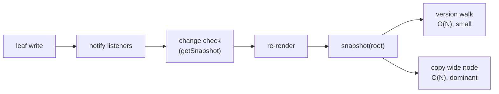

# Valtio v3 O(1) Subscription — Design

Draft 2 · 2026-09-25

## Summary

A leaf write such as `state.items[5].count++` should cost work proportional to that item's readers and its ancestors, not to its siblings or to unrelated subscribers. Nothing is implemented until this design is agreed.

1. **Vanilla:** key subscriptions and an own-keys subscription on `subscribe`, and versions pushed up to parents so `snapshot()` stops walking the tree.
2. **React:** `useSnapshot` subscribes to exactly the keys a committed render read. For newly read keys, it compares what the render saw with live state. It does no leaf comparison otherwise, and it drops proxy-compare.
3. **Boundary:** React uses only `snapshot`, `subscribe` and `isProxyObject` from vanilla. Vanilla never refers to React.

This draft folds in the review on this PR and on #2, where the author of #2 and I converged on every point below except the ones listed in [Open questions](#open-questions). The table there separates decisions you made from agent consensus that still needs your sign-off.

## Goals and requirements

The goal is fast atomic mutation: `state.nested.count = 1` must not cost work proportional to unrelated state or subscribers. Replacing a whole object (`state.nested = { count: 1 }`) may cost more; `applyChanges` is its fast path.

| #   | Requirement                                                                                            | Consequence for this design                                                                                     |
| --- | ------------------------------------------------------------------------------------------------------ | --------------------------------------------------------------------------------------------------------------- |
| R1  | A leaf write is cheap in the #1160 scenario: N item components, one item changes                       | Fan-out, change detection and version bookkeeping must all avoid O(N)                                           |
| R2  | A migrating v2 user notices breaking changes through a TypeScript or runtime error, for most use cases | Silent breaks are allowed only when harmless (extra renders) or rare (docs only)                                |
| R3  | `valtio/react` is built on `valtio/vanilla`; vanilla knows nothing about React                         | React uses public vanilla exports only, no `unstable_*` internals; vanilla never unwraps or marks React objects |

R3 fixes a v2 violation: `src/vanilla.ts` imports `markToTrack` and `getUntracked` from proxy-compare, marking snapshots for React's tracking and unwrapping React's proxies on assignment.

**Non-goals for this branch:** getter result caching (`valtio-reactive` covers computed values), valtio-reactive compatibility, scoped `ref`, and a replacement for `unstable_replaceInternalFunction`.

## Decisions so far

| Topic                                   | Decision                                                                                       | Status                                    |
| --------------------------------------- | ---------------------------------------------------------------------------------------------- | ----------------------------------------- |
| `notifyInSync`                          | Removed, with `batch()` and `subscribeInAsync`, in a precursor PR into `v3`                    | Maintainer                                |
| `isProxyObject`, `unstable_isRef`       | In this branch                                                                                 | Maintainer                                |
| `useSnapshot` with no reads             | Subscribes to nothing; a silent, harmless change                                               | Maintainer                                |
| Getter caching                          | Dropped; getters are live                                                                      | Maintainer                                |
| Snapshot symbol for the runtime error   | Allowed; kept unexported                                                                       | Maintainer; unexported by agent consensus |
| Leaf comparison                         | None, so an equal replacement re-renders                                                       | Consensus, needs sign-off (Q3)            |
| Key subscription shape                  | `subscribe(p, cb, { keys })` and `{ ownKeys: true }`; no `getVersion(p, key)`                  | Consensus, needs strict review (Q4)       |
| React subscription timing               | Subscribe in the hook's layout effect, then check newly read keys; never in render             | Consensus                                 |
| `proxy(snapshot)`                       | Throws, like assigning a snapshot                                                              | Consensus                                 |
| `applyChanges` values it cannot recurse | Normal `set` semantics, except snapshots, which are cloned                                     | Consensus                                 |
| `trackKey`, `useDebugValue` key list    | Both kept                                                                                      | Consensus                                 |
| Dev warning for closure getters         | None; docs only                                                                                | Consensus                                 |
| Native array methods                    | Notify per internal write; `batch()` is the remedy                                             | Consensus                                 |
| Collection snapshot through a wrapper   | Fixed in this branch                                                                           | Consensus; mechanism revised below (Q6)   |
| Wide-node snapshot copy                 | Stays O(N) per write in this branch; on-demand materialization is a follow-up                  | Consensus, needs sign-off (Q2)            |
| Records                                 | Accumulate per held snapshot, as v3 does today                                                 | Consensus (from #2)                       |
| Reads in event handlers                 | Subscribe until the snapshot changes, as in v2; revises the earlier "never subscribe" position | New in this draft; required by v3's tests |

## Problem analysis: where #1160's O(N) lives

Key subscriptions remove the N-way fan-out, but a leaf write can still cost O(N). Over 90% of what remains is copying the snapshot of the wide node that holds the N items; the version walk is under 10%.

The #1160 shape: `state.items` holds N objects, and N components each render `useSnapshot(state).items[id].count`. One write changes one item.

v3 today pays O(N) at the notify step, one callback per component. The WIP candidate pays it only in the last step, once per write.

| Per leaf write                                 | v3 today (v2 design) | WIP candidate |
| ---------------------------------------------- | -------------------- | ------------- |
| Components woken                               | N                    | 1             |
| Write to commit, N = 1,000                     | 5.1 ms               | 3.6 ms        |
| Write to commit, N = 5,000                     | 25.4 ms              | 9.5 ms        |
| `snapshot(root)`, N = 5,000: version walk only | 0.30 ms              | 0.35 ms       |
| `snapshot(root)`, N = 5,000: walk + copy       | 4.1 ms               | 4.3 ms        |
| `snapshot(root)`, N = 50,000: walk + copy      | 82 ms                | 89 ms         |

Medians of 15 writes, vitest + jsdom, React 19 dev build. The walk-only row writes to an unrelated proxy, so only the global clock moves.

**Where the hook is called decides the rest.** If each item component calls `useSnapshot` on its own item, the root is never snapshotted on an item write. The next table is analysis, not measurement; the validation plan measures it.

| Per leaf write                                                                                                 | v3 today                                                                        | This design                            |
| -------------------------------------------------------------------------------------------------------------- | ------------------------------------------------------------------------------- | -------------------------------------- |
| **Root hook:** each item calls `useSnapshot(state)` and reads `items[id].count`                                | N components woken, one O(N) copy                                               | 1 component woken, one O(N) copy       |
| **Item hook:** each item calls `useSnapshot(state.items[id])`; the list parent reads `Object.keys(snap.items)` | 2 components woken; the list parent snapshots `items` (O(N)) and then bails out | 1 component woken, O(keys of one item) |

So with the item-hook pattern, this design makes #1160 O(depth + one item) per write without changing snapshots, and the docs should recommend it for large collections. With the root-hook pattern, the O(N) copy remains until on-demand materialization ([Option B](#option-b-on-demand-materialization)).

## Delivery plan

Two PRs, in order.

**PR 1 — precursor into `v3`: sync-only notifications**

- Remove `notifyInSync` from `subscribe` and `subscribeKey`, and `sync` from `useSnapshot` and `useProxy`. Each removal is a TypeScript error. Passing the old argument also throws at runtime with a message that names `batch()` and `subscribeInAsync`, so JavaScript users notice too, as #2 proposes.
- Add `batch(fn)` to vanilla. Listeners are deferred until the outermost `batch` returns, then each runs once with the accumulated ops. Versions still move immediately, so `snapshot()` inside a batch sees the writes.
- Add `subscribeInAsync` to `valtio/utils`: today's microtask-batched delivery, used by `devtools`.
- `proxyMap` and `proxySet` wrap each method in `batch()`, and flush only after both their index and their data are updated. Native `splice` and `sort` keep notifying per internal write, because a `get` trap on every array read is the wrong cost; callers wrap them in `batch()`.

**PR 2 — `v3-o1-subscription` into `v3`**, one reviewable commit per layer, each passing the suite on its own:

1. Vanilla: `isProxyObject` and `unstable_isRef`; utils use them instead of reading `unstable_getInternalStates`.
2. Vanilla: lazy parent links. This is a pure speed-up with no API change: `snapshot()` stops walking the tree.
3. Vanilla: `subscribe(p, cb, { keys })` and `{ ownKeys: true }`. `subscribeKey` is rebuilt on them, and deleting an absent key no longer notifies.
4. Vanilla: snapshot semantics. Getters are live, snapshots carry the brand, and assigning a snapshot throws. `deepClone` skips the brand.
5. Utils: collections keep their index in state.
6. React: the new tracker and `trackKey`, and removal of the proxy-compare dependency.
7. Utils: `applyChanges`.
8. Docs: migration guide, API pages, and the item-hook pattern for large collections.

Tests from the WIP branches are ported into the commit whose behavior they cover. Both PRs are pushed to `daishikato/valtio`.

## Vanilla: versions and lazy parent links

Every write takes one number from a global clock. A proxy's version is the latest write anywhere in its subtree, so it changes exactly when `snapshot(p)` would. There are no per-key versions, because React compares values instead ([React section](#react-usesnapshot)).

- A parent links to its children the first time something needs its subtree version: `snapshot(p)`, `getVersion(p)`, or a subtree `subscribe(p)`. That first pass is O(subtree), and the first snapshot pays it anyway.
- After that, a write pushes its version to every linked ancestor, in O(depth × parents), and notifies their subtree listeners on the way. A `snapshot` of an unchanged subtree is then a cache hit, and registering a subtree listener is O(1).
- A child assigned into a linked parent is linked immediately. Replacing or deleting a child unlinks it.
- Cycles and shared children need only a visited set per write. Versions are pushed, not recomputed, so the Tarjan-style pass in the WIP branches is unnecessary.
- Implicit writes count. `push` writes the new index and `length`, and shrinking `length` deletes the removed indices.

The alternative is linking every child at creation. That differs only for state that is never snapshotted or subscribed, which would then pay O(depth) per write for nothing.

Lazy parent links remove the version walk from #1160, not the wide-node copy.

## Vanilla: notifications and public API

`subscribe` gains two options on the third parameter, which PR 1 frees. Every listener is synchronous after PR 1 and deferred inside `batch()`. Writing the same value, or deleting an absent key, notifies nobody.

| Call                                     | Fires on                                                                                                                  | Registration      |
| ---------------------------------------- | ------------------------------------------------------------------------------------------------------------------------- | ----------------- |
| `subscribe(p, cb)`                       | Any write in `p`'s subtree, as today                                                                                      | O(1) once linked  |
| `subscribe(p, cb, { keys: ['a', 'b'] })` | A direct set or delete of a listed key on `p`, including implicit ones such as `length`. Descendant writes do not fire it | O(number of keys) |
| `subscribe(p, cb, { ownKeys: true })`    | An own key of `p` added or deleted; value writes do not fire it                                                           | O(1)              |

- `keys` and `ownKeys` can be combined in one call. React makes one registration per proxy it read.
- Replacing `state.child` fires `state`'s key listener for `child`. The old child's own listeners stay silent, because it was detached, not mutated. The WIP branches notified the whole old subtree instead.
- `subscribeKey(p, key, cb)` in utils becomes a key subscription, which is O(1), the goal of #1161.
- Plural `keys` makes the "non-recursive with keys, subtree without" split explicit in one place.

**Exports, for strict review**

| Export                               | Status                   | Semantics                                               | Used by                            |
| ------------------------------------ | ------------------------ | ------------------------------------------------------- | ---------------------------------- |
| `subscribe(p, cb, options?)`         | Third parameter replaced | `{ keys }` and `{ ownKeys: true }` as above             | React, `subscribeKey`              |
| `batch(fn)`                          | New, PR 1                | Defers listeners to the outermost `batch`               | Collections, `applyChanges`, users |
| `isProxyObject(x)`                   | New                      | Boolean membership; deliberately not a type guard       | React, collections, `applyChanges` |
| `unstable_isRef(x)`                  | New                      | Boolean                                                 | `deepClone`, `applyChanges`        |
| `subscribeInAsync` in `valtio/utils` | New, PR 1                | Microtask-batched `subscribe`, today's default delivery | `devtools`, users                  |
| `applyChanges` in `valtio/utils`     | New                      | See [applyChanges](#applychanges)                       | Users                              |
| `trackKey` in `valtio/react`         | New                      | Replaces proxy-compare's `trackMemo`                    | Users                              |

**Not proposed:**

- `getVersion(p, key)`. `getVersion` stays single-argument.
- An exported snapshot symbol, or snapshot-to-source registries.
- Recursive key subscriptions, and notifications to detached subtrees.

`unstable_getInternalStates` gains one entry, the snapshot brand, which `deepClone` and `applyChanges` need. `unstable_replaceInternalFunction` stays as it is.

## Vanilla: snapshot semantics

Snapshots stay plain objects with read-only data properties and their original prototypes. Two things change: own getters become live accessors, and every snapshot object carries a brand that makes assigning it into state throw.

**Live getters**

- An own getter is copied to the snapshot as an accessor, not evaluated. Each access runs it with the snapshot, or with React's tracked snapshot, as `this`. That makes the reads it makes through `this` React's subscription, so a root `get total()` does not subscribe to the whole store.
- Results are not cached, so an object-returning getter returns a new identity on each access. Exceptions surface on access, not in `snapshot()`.
- A getter that reads `state.count` through a closure reads live state and is not tracked. This is docs-only, with no dev warning.
- Own setters are left out of snapshots. Class accessors on the prototype behave as today. `Object.preventExtensions` stays out, for Hermes (#1220).

**Brand and the assignment error**

- Each snapshot object carries a non-enumerable own symbol, which is not exported. Spread, `Object.assign`, JSON and `structuredClone` do not copy it.
- `proxy(x)` and the `set` trap throw a `TypeError` when the incoming object carries the brand, pointing to `deepClone`, `applyChanges` and `ref`. That covers:
  - `state.x = snap`
  - `state.x = { child: snap.y }`
  - `arr.push(snap)`
  - `map.set(k, snap)`
  - `proxy(snap)`
- `ref(snap)` stays allowed, for storing history.
- React's tracker forwards reads of a snapshot's non-enumerable own symbols without recording them. So `state.x = tracked.y` throws the same error, and the brand check never becomes a subscription. User symbol keys are created enumerable by assignment, so they stay tracked, as in v2.
- `deepClone` skips the brand. It reads the symbol from `unstable_getInternalStates()`, as `applyChanges` does.

These cases already fail on v3 today, just silently:

- After `state.b = snap.a`, the write `state.b.count = 2` leaves `count` at 1.
- `proxy(snapshot(state))` drops a top-level write and throws `Cannot assign to read only property` on a nested one.

Read-only uses did work, such as storing a snapshot for display, so the error message must point to `ref`.

## Collections: `proxyMap` and `proxySet`

On v3 today, collections have two problems that interact with key subscriptions. Both are in scope.

1. **A snapshot read through a wrapper uses the live index.** Snapshot methods look up their index copy in a `WeakMap` keyed by `this`, and a wrapper misses it. React's tracker is such a wrapper. After later writes, `new Proxy(snapshot(m), {}).get('first')` returns `undefined` while `size` still reports the snapshot's count.
2. **Every `has()` reader re-renders on every `set()`.** `set()` bumps `epoch` even on a value-only update, and `has()` reads `epoch`.

The review settled on a private symbol holding the index copy. This draft proposes the `versioned-index` WIP branch's approach instead: the index lives in state, as a proxied lookup object with one entry per key. A snapshot then carries its own lookup, and any wrapper reads it by ordinary property access. That needs no `WeakMap` keyed by `this`, no hook into snapshot creation, and no `snapCache`.

- `has(k)` and a missing-key `get(k)` read that key's lookup entry. A present-key `get(k)` also reads `data[i]`.
- `size` and iteration read the size entry and the slot list.
- A value-only `set` writes only `data[i]`, so `has` readers and the list parent stay quiet.
- The WIP branch writes lookup entries around the proxy and reads a global `lookup.version` in every lookup, which brings back problem 2. This design writes entries through the proxy and drops that read.
- Object keys map to per-object symbols in the lookup. These are enumerable, so the tracker records them like any user key.
- Cost: after a structural change, the next snapshot copies the lookup, which is the same order as copying `data`.

## React: `useSnapshot`

`useSnapshot(p)` returns a tracking proxy over a held snapshot `S` of `p`. Reads are recorded per snapshot. The hook's layout effect turns the committed snapshot's records into subscriptions and checks the newly read ones against live state.

### Render: what a read records

Each tracked node wraps a snapshot object `Sₙ` and is bound to the live proxy `Pₙ` it stands for, with the root bound to `p`. A child binds to the live `Pₙ[k]` when `isProxyObject` holds for it; otherwise the child is a leaf and is returned as is. Binding follows the live path, so there is no snapshot-to-source registry, and the check below makes a stale binding harmless.

| Read on node `(Sₙ, Pₙ)`                                   | Record                                              | Subscription        | Check for a newly read record |
| --------------------------------------------------------- | --------------------------------------------------- | ------------------- | ----------------------------- |
| `t.k`, own data value, or a missing key                   | Leaf: the value seen, or `undefined`                | Key `k` on `Pₙ`     | `Object.is(seen, Pₙ[k])`      |
| `t.k`, an object bound to `C = Pₙ[k]`                     | Path to `C`                                         | Key `k` on `Pₙ`     | `Pₙ[k] === C`                 |
| `t.k`, an accessor, own or inherited                      | Nothing for `k`; the getter runs with `t` as `this` | Its reads' records  | Its reads' checks             |
| `t.k`, an inherited non-accessor, such as `map`           | Nothing                                             | —                   | —                             |
| `'k' in t`, `Object.hasOwn(t, k)`                         | Presence seen                                       | Key `k` on `Pₙ`     | Same presence on `Pₙ`         |
| `Object.keys(t)`, `for...in`, spread                      | Own-key list seen                                   | `{ ownKeys: true }` | Same list on `Pₙ`             |
| A bound node with no reads under it, or `trackKey(t.obj)` | Container: the snapshot seen                        | Subtree on `C`      | `snapshot(C) === seen`        |
| A snapshot's non-enumerable own symbol, such as the brand | Nothing                                             | —                   | —                             |

- **Containers:** the "no reads under it" rule gives v2's identity semantics to a node that is only passed on, such as an effect dependency or a prop to a memoized child that never rendered against this snapshot.
- **Snapshot identity, not `getVersion(C)`,** is the container check. A version read at render time can already include a write that the held snapshot does not show, so it would pass while the render used stale data.
- **`trackKey(t.obj)`:** forces a container record for `t.obj` and returns it. It is a drop-in for `trackMemo(t.obj)`, where a component reads `t.obj.x` but also depends on the identity of `t.obj`.
- **Accessor keys** are never value-compared. An object-returning getter returns a new identity on each access, so comparing it would re-render forever.
- **Tracked proxies** are cached per hook by snapshot object. An unchanged subtree keeps its identity across renders, so `memo` bails out.
- **Dev only:** the recorded keys are listed with `useDebugValue`.

### Records are kept per snapshot

Every tracked node belongs to one root snapshot `S`, and a read, from any component, goes into the record set for `S`. The set grows while `S` is the held snapshot, and a new snapshot starts an empty set. This is the rule #2 proposed, and it is what v3 does today.

- A re-render on the same snapshot, from a prop change or local state, keeps the keys read earlier. That includes keys read by memoized children that bail out this time. The existing test "should retain keys accessed before a prop change" covers it.
- A read into a set that is already installed is a late read (below). This covers a child that calls no valtio hook and re-renders on its own, as in "should grow committed subscriptions during a suspended render".
- The set for a snapshot that never commits is dropped without subscribing.

### Commit: reconcile, then check

A layout effect in the hook runs after every commit and does two things:

1. **Reconcile.** Install the set for the committed snapshot and remove subscriptions that are not in it. This is O(changed records), and key and own-key records are grouped into one `subscribe` call per proxy.
2. **Check** the records that were not installed before this commit. If one fails, mark the held snapshot stale and schedule a sync re-render. An update scheduled in a layout effect is processed before paint.

Why this is enough:

- **Records installed by an earlier commit** were listening all along. Any write to them has already marked the snapshot stale.
- **Newly read records** are what the check covers. It runs after the children's layout effects and after layout effects declared before `useSnapshot` in the same component. So a write from one of those to a key read for the first time is on screen before paint. With a passive subscription, that write would show one frame late.
- **Layout effects declared after `useSnapshot`** write into listeners that are already installed. The existing test "should detect a new-key mutation before passive subscription" covers that case.
- **A render that never commits** with a new snapshot never reaches the effect, so its set never subscribes. One that reuses the committed snapshot, such as Strict Mode's extra render or a transition that suspends, adds late reads. Those last only until the snapshot changes. Every listener belongs to the mounted hook and is removed on unmount, so no finalization registry is needed.
- **A hidden `<Activity>`** drops all subscriptions. Showing it again reinstalls and checks every record, so writes made while it was hidden appear before the first paint.

The invariant is that after each commit, the held snapshot agrees with live state on every installed record. The check establishes that for new records, and listeners maintain it for the rest. So the component re-renders when something it read changes, plus only the extra renders listed in the next section.

### Between commits

- **Listeners** mark the held snapshot stale and notify React. They use `useSyncExternalStore`'s callback, or a state update on mount, before that callback exists.
- **`getSnapshot`** returns the held snapshot until it is stale, then takes `snapshot(p)` once. An unrelated write never changes what it returns, so React's consistency checks never copy the wide node.
- **Late reads** go into a set that is already installed. They come from a child that re-renders on its own, an effect, an event handler, or a render on the committed snapshot that never commits.
  - A microtask subscribes a late read and runs the same check on it.
  - Late reads only add subscriptions; they never narrow a container. They are dropped when the snapshot changes.
  - React offers no public way to tell a render from an event handler, so a handler's read subscribes too. That costs at most one extra render: the next write to that key replaces the snapshot, and the new set drops the key. v2 behaves the same.
  - This revises the earlier "event handlers do not subscribe" position. The hook cannot implement it without React internals, and the existing suspended-render test needs late reads from a child that calls no valtio hook.

### Limits

- A write that is reverted before the check is missed. That is harmless, because the rendered value equals the live value.
- Values stored with `ref()`, and other objects that are not proxied, compare by identity, so an in-place mutation is invisible. This is the same as v2.
- An own property that later shadows an inherited one is not seen.

### Option B: on-demand materialization

React stops calling `snapshot(p)`. Tracked objects become views over live proxies, created per node on first read and cached per proxy version.

- **Gain:** a render costs O(keys read). The wide-node copy measured above (4.3 ms at N = 5,000, 89 ms at N = 50,000) disappears, even with the root-hook pattern.
- **Cost:** views are not snapshots. A tracked value read in an event handler after a later write returns the newer value, where v2 returns the render-time value. That change is silent, so it needs its own R2 decision and migration note.
- **Why not a cheaper eager copy:** it only changes constants. Even a plain `{ ...prev }` clone of a 50,000-key object takes 27 ms here.

B needs no vanilla API beyond this design's, so the vanilla design does not depend on the choice. I propose Option A for this branch, with B as a follow-up.

## React: what users see, and which tests change

Dropping leaf comparison costs one tested behavior: replacing a child with equal leaves now re-renders. Using key listeners for `in` and `hasOwn` costs two more: a value-only write now re-renders those readers. The other test changes follow from decisions already made.

**Extra renders.** All are silent and harmless, which R2 allows.

| Case                                                                                   | v2        | This design                 |
| -------------------------------------------------------------------------------------- | --------- | --------------------------- |
| Replacing a read child with equal used leaves, e.g. `state.data = await res.json()`    | No render | Render                      |
| A getter's result is unchanged but its input changed, e.g. `isEven` after `count += 2` | No render | Render                      |
| `'k' in t` or `Object.hasOwn(t, k)`, then `k`'s value changes                          | No render | Render                      |
| A key read only in an event handler later changes                                      | Render    | Render (unchanged)          |
| A `proxyMap` value-only `set` with `has()` readers                                     | Render    | No render (collections fix) |

The first row is the fetch-and-replace pattern. Its v3 remedy is `applyChanges(state.data, await res.json())`, documented in the migration guide.

**Existing `v3` tests that change.** I found these by reading the suite; an implementation will confirm the list.

| Test                                                                     | Cause                                                  | Driven by          |
| ------------------------------------------------------------------------ | ------------------------------------------------------ | ------------------ |
| `optimization`: "should not rerender if the leaf value does not change"  | Equal-leaf replacement re-renders                      | No leaf comparison |
| `optimization`: "should unwrap nested snapshots assigned outside render" | The assignment now throws                              | Snapshot brand     |
| `getter`: "simple object getters", "object getters returning object"     | The getter runs on every access, not once per snapshot | Live getters       |
| `vanilla/snapshot`: proxy-compare interop                                | proxy-compare is removed                               | R3                 |
| `optimization`: "should track property existence with the in operator"   | A value-only write re-renders an `in` reader           | Key listeners      |
| `optimization`: "should track own-property checks"                       | A value-only write re-renders a `hasOwn` reader        | Key listeners      |
| Tests passing `notifyInSync` or `{ sync: true }`                         | They drop the argument                                 | PR 1               |

"should track property enumeration" keeps passing because of `{ ownKeys: true }`. The design relies on four existing tests that keep passing:

- "should retain keys accessed before a prop change"
- "should detect a new-key mutation before passive subscription"
- "should keep committed subscriptions during a suspended render"
- "should grow committed subscriptions during a suspended render"

## `applyChanges`

`applyChanges(proxy, next)` in `valtio/utils` merges `next` into an existing proxy, writing only what differs, inside one `batch()`. `next` can be plain data, a vanilla snapshot, or a React tracked snapshot.

For each own enumerable key of `next`, where `cur = proxy[k]` and `v = next[k]`:

1. Skip `v` if `Object.is(cur, v)`, or if `v` is a snapshot and `snapshot(cur) === v`. The second test skips unchanged subtrees of an immutable update in O(1), which keeps jotai-valtio's advantage without its three-argument signature.
2. Skip accessor properties. Snapshots of state with getters carry them, and the proxy already has its own.
3. Throw on a `proxyMap` or `proxySet` snapshot, and suggest building a new collection from its entries. A clone of one would keep methods that close over the source's index.
4. Recurse if `cur` is a proxy and `v` is an object with the same prototype.
5. Build any other plain object or array by recursion into a fresh object. Input objects are never adopted as proxy targets, so a snapshot nested at any depth never reaches the `set` trap.
6. Assign any other snapshot as a `deepClone`, which keeps its prototype, shares `ref` values and drops the brand.
7. Assign everything else as a normal `set` would, so a `Date`, a `ref`, a class instance or a live `proxyMap` stays the caller's object.

Then delete own data properties absent from `next`. Accessors are never deleted.

A tracked snapshot passed as `next` from an event handler records late reads, so it can cause one extra render. The docs recommend `snapshot(state)` there.

## Migration: how users notice each change

Every break that changes correctness surfaces as a TypeScript or runtime error, except the two getter changes, which are docs only.

| v2 → v3 change                                                                    | Detection                          | Remedy                                  |
| --------------------------------------------------------------------------------- | ---------------------------------- | --------------------------------------- |
| `notifyInSync` and `sync` removed (PR 1)                                          | TypeScript and runtime error       | Remove the argument; use `batch()`      |
| A snapshot or tracked snapshot assigned into state, or passed to `proxy()`        | Runtime `TypeError` (brand)        | `deepClone`, `applyChanges`, or `ref`   |
| An own setter called on a snapshot                                                | Runtime `TypeError` in strict mode | Write to the proxy                      |
| `Object.freeze` on a snapshot, then `useSnapshot`                                 | Runtime error                      | Don't freeze snapshots                  |
| A getter reads state through a closure (`state.count`)                            | Docs                               | Read through `this`                     |
| Snapshot getters are not cached; object results get a new identity per access     | Docs                               | `proxy-memoize` or `valtio-reactive`    |
| `trackMemo` and `getUntracked` from proxy-compare stop working on tracked objects | Docs                               | `trackKey`; read the proxy in callbacks |
| `useSnapshot` with no reads no longer subscribes                                  | Silent, harmless (accepted)        | Read what you render                    |
| Extra renders (previous section)                                                  | Silent, harmless                   | `applyChanges`                          |
| Deleting an absent key no longer notifies                                         | Silent, harmless                   | —                                       |
| `unstable_getInternalStates` contents and collection internals change             | Unstable API                       | —                                       |

The closure-getter row is the riskiest, because v2's computed-properties guide itself used `state.count` inside getters. The guide has to change in the same release.

## Validation plan

Each item becomes a test in the commit whose behavior it covers.

- **#1160 benchmark, committed this time:**
  - Both component patterns at N = 1,000, 5,000 and 50,000.
  - Reports components woken, write-to-commit time, and `snapshot` calls per write.
- **Render→commit gaps:**
  - A write from a child's layout effect, and one from a later sibling's, to a key first read in this render.
  - Both are in the DOM before the passive phase.
- **Renders that never commit:**
  - Strict Mode, an interrupted transition, and a render that suspends.
  - None of them leaves a listener behind.
- **`<Activity>`:** hide, write, then show. The first visible commit has the new value.
- **Memoized children:**
  - Reads in the same pass.
  - A later self-render that reads new keys.
  - A parent re-render where the child bails out.
  - No update is missed in any of them.
- **Event-handler reads:** at most one extra render, then dropped with the snapshot.
- **Precision:**
  - A list parent stays quiet on item value writes.
  - `in` on a missing key re-renders when the key is added.
  - A getter re-renders only on its `this` reads.
  - An object-returning getter does not loop.
- **Brand:**
  - Every assignment path listed in the snapshot section throws.
  - `ref(snap)` and `proxy(deepClone(snap))` work.
- **`applyChanges`:**
  - Equal leaves stay quiet.
  - One notification per call.
  - The identity skip works.
  - Accessors are skipped.
  - A collection snapshot throws.
- **Collections:**
  - `get`, `has` and `size` agree through a wrapper after later writes.
  - A value-only `set` leaves `has` readers quiet.
- **Bundle:** report minified and gzipped sizes against `v3` plus proxy-compare (6,188 / 2,985 B) and the WIP candidate (10,533 / 4,431 B).
- **Existing suite:** passes, except the tests listed above.

## Open questions

Q1 and Q2 decide scope. Q3 and Q4 are the sign-offs the consensus rows above need.

1. **"On-demand subscription":** I read it as subscribing only to what a render read, which this design does. Lazy parent links remove the version walk. The wide-node copy stays, as Q2. Does that match what you meant?
2. **Wide-node copy:** is Option A acceptable for this branch, with the item-hook pattern documented as the O(depth) path and Option B as a follow-up? Or must the root-hook pattern be O(1) now?
3. **Breaking changes:** sign off on
   - equal replacement re-rendering
   - live, uncached getters, with closure reads untracked
   - `proxy(snapshot)` and snapshot assignment throwing
   - event-handler reads subscribing until the snapshot changes
4. **API, strict review:**
   - In vanilla: `{ keys }`, `{ ownKeys: true }`, `isProxyObject`, `unstable_isRef` and `batch`, plus the brand entry in `unstable_getInternalStates`.
   - In utils: `subscribeInAsync` and `applyChanges`.
   - In React: `trackKey`.
5. **Lazy parent links:** keep them as commit 2 of this branch, or ship them first as their own PR? They are vanilla-only, change no API, and speed up `snapshot()` today.
6. **Collections:** keep the index in state, as in `versioned-index` minus its global version read, instead of the private-symbol copy the review first settled on?
7. **Names:** `trackKey`, `ownKeys`, `subscribeInAsync`, `unstable_isRef`.
8. **Your remaining preferences**, major and minor, before implementation starts.

## Appendix: evidence and references

All measurements ran in this session's container: Node 22.22.2, vitest 4.1.5 with jsdom, React 19.2.5 dev build. `v3` is `fb594a1`; the WIP candidate is `v3-o1-subscription-versioned-index` at `1fec378`. The benchmark code is not committed yet; the validation plan commits it.

| Finding                                                                             | Result                                                                                               |
| ----------------------------------------------------------------------------------- | ---------------------------------------------------------------------------------------------------- |
| Version checks per `snapshot(root)` over 1,000 items, after an unrelated root write | 1,002 on both `v3` and the candidate                                                                 |
| Key listeners registered per render by the candidate's `useSnapshot`                | Re-registered on every render; `v3` registers its listeners once                                     |
| v2 (`main`): `state.b = snap.a; state.b.count = 2`                                  | `count` stays 1, no error                                                                            |
| `v3` `proxyMap`: `new Proxy(snapshot(m), {}).get('first')` after later writes       | `undefined`, expected 1                                                                              |
| Copying a 50,000-key node                                                           | 89 ms full snapshot; 38 ms per-key copy loop; 27 ms plain `{ ...prev }`                              |
| Bundle, minified / gzipped                                                          | Candidate 10,533 / 4,431 B, no dependencies; `v3` 3,561 / 1,734 B plus proxy-compare 2,627 / 1,251 B |

**Sources**

- [#1160 — useSnapshot is O(N) for a big Map](https://github.com/pmndrs/valtio/discussions/1160)
- [#1161 — O(1) subscribeKey and useSnapshot (closed PR)](https://github.com/pmndrs/valtio/pull/1161)
- [#1177 — Ideas for v3](https://github.com/pmndrs/valtio/discussions/1177)
- [#1220 — remove `Object.preventExtensions` for Hermes](https://github.com/pmndrs/valtio/pull/1220)
- WIP branches: [baseline](https://github.com/pmndrs/valtio/tree/v3-o1-subscription-baseline), [proxied-index](https://github.com/pmndrs/valtio/tree/v3-o1-subscription-proxied-index), [versioned-index](https://github.com/pmndrs/valtio/tree/v3-o1-subscription-versioned-index)
- [jotai-valtio 0.6.0](https://www.npmjs.com/package/jotai-valtio): `src/atomWithProxy.ts` in the published package, including its `applyChanges`
- Review threads: this PR and [#2](https://github.com/daishikato/valtio/pull/2)
